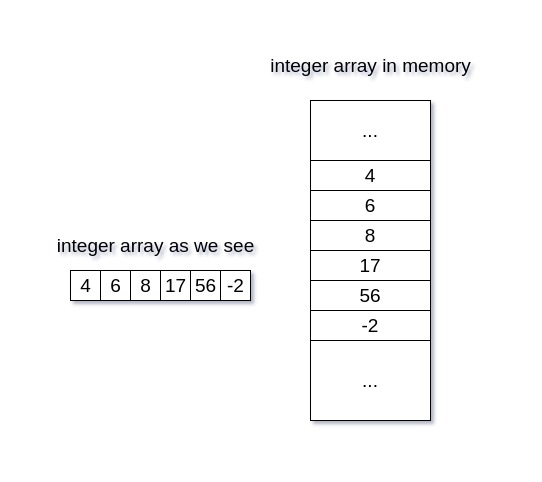

# Python list


## What is list?
- **Definition**: A list is an ordered, mutable, and iterable collection in Python that can hold elements of different types.
- **Syntax**: 
```python
  my_list = [1, 2, 3, 4]
  ```


# Array vs List 

## Key Differences

1. **Fixed vs Dynamic Size**:
   - **Array**:
     - Fixed size when created. Cannot dynamically grow/shrink.
     - Used for efficient memory management and performance.
   - **List**:
     - Dynamic size. Can grow or shrink as needed.
     - Convenient for everyday tasks where size is unpredictable.

   **Example**:
   ```python
   from array import array

   # Array: Fixed size, requires type declaration
   arr = array('i', [1, 2, 3])  # 'i' for integers
   arr.append(4)  # Limited dynamic capability
   # You cannot mix types in an array

   # List: Fully dynamic
   lst = [1, "hello", 3.14]
   lst.append("world")  # Completely flexible

2. **Homogeneous vs Heterogeneous**:
   - **Array**:

      - Homogeneous: All elements must be of the same data type.

   - **List**:

      - Heterogeneous: Can store elements of mixed data types (e.g., integers, strings, floats, etc.).
   ```python
   # Array: Homogeneous
   arr = array('f', [1.1, 2.2, 3.3])  # Only float values allowed

   # List: Heterogeneous
   lst = [1, "text", 3.14, [5, 6]]
   ```
3. **Speed of Execution**:

   - **Array**:
      - Faster for numerical operations and computation-heavy tasks due to its low-level data handling.
   - **List**:
      - Slower due to its flexibility (e.g., type checking for mixed elements, dynamic resizing).

   ```python 
   import time

   # Array operations
   arr = array('i', range(1_000_000))
   start = time.time()
   arr_sum = sum(arr)
   print("Array sum:", time.time() - start)

   # List operations
   lst = list(range(1_000_000))
   start = time.time()
   lst_sum = sum(lst)
   print("List sum:", time.time() - start)
   ```

4. **Memory Usage**:

   - **Array**:
      - Takes less memory due to type constraints and compact data storage.
   - **List**:
      - Takes more memory since it stores metadata for each element to allow dynamic resizing and heterogeneity.

   ```python 
   import sys

   arr = array('i', range(1000))
   lst = list(range(1000))

   print("Array size:", sys.getsizeof(arr))
   print("List size:", sys.getsizeof(lst))
   ```
5. **Convenience**:

   - **Array**:
      - Limited operations (e.g., numerical computation). Must use specialized libraries like numpy for advanced operations.
   - **List**:
      - Provides more built-in methods (e.g., slicing, indexing, appending), making it easier for general use.

| **Feature**     | **Array**                | **List**                      |
|------------------|--------------------------|--------------------------------|
| **Size**        | Fixed                   | Dynamic                       |
| **Type**        | Homogeneous             | Heterogeneous                 |
| **Performance** | Faster for computation  | Slower for computation        |
| **Memory**      | Less                    | More                          |
| **Convenience** | Limited operations      | Flexible with many methods    |

## How are arrays stored in memory?

1. **Contiguous Memory Allocation**:

   - Arrays are stored in a contiguous block of memory.
   - Each element of the array is placed sequentially in adjacent memory locations.
   - The array's starting address (base address) points to the memory location of the first element.

2. **Memory Address Calculation**:
   - The memory address of each element is calculated using the formula:
     - `Address = Base_Address + (Index * Size_of_Element)`
   - Example: For an integer array arr[50] with a base address of 1000 (in bytes) and each integer taking 4 bytes:

     - Address of arr[0] = 1000
     - Address of arr[1] = 1000 + (1 * 4) = 1004
     - Address of arr[2] = 1000 + (2 * 4) = 1008

2. **Efficiency**:

   - Contiguous storage allows for fast access to elements using their index.
   - Since the memory address of an element can be directly computed, accessing an element in an array is an O(1) operation.
3. **Data Representation**:

   - Instead of storing the actual value (e.g. 4) in memory, the system stores the binary equivalent.
   - Example:  
     - `4 in binary (for 4 bytes): 00000000 00000000 00000000 00000100`

### Advantages of Contiguous Storage:

   - Efficient Indexing:
      -  Direct access to elements without searching.
   - Cache Optimization:
      -  Contiguous blocks make array operations cache-friendly.



---

## How are lists stored?

> List = [1,2,3,4,5]

Let's say the number 1 is stored at memory address 500, the number 2 at address 1000, and so on. Instead of storing the actual numbers, a memory block will store these addresses. This memory block also has its own address, like 5000 for example, where the reference to 1 is stored. This is known as a **referential array**.

# Referential Array

## How Are Lists Stored in Memory?

### Key Concepts:

#### 1. Dynamic Storage:
- Python lists are **dynamic arrays**, but unlike traditional arrays:
  - They can store elements of **different types**.
  - Lists do not store the actual data values directly; instead, they store **references (or pointers)** to the memory addresses of the objects they contain.

#### 2. Referential Array:
- A Python list is essentially a **referential array**:
  - The list itself is a **block of memory** (contiguous) that stores references (pointers) to other objects.
  - Each object referenced can be located **anywhere in memory**.

#### Example:
```python
List = [1, 2, 3, 4, 5]
```
- Memory Address for the List: 5000
- References in the List:

   - Reference to 1 stored at 5000
   - Reference to 2 stored at 5004
   - Reference to 3 stored at 5008

- Actual values (1, 2, etc.) stored at memory locations like 500, 1000, etc.

3. **Advantages of Referential Array**:

   - Flexibility:
      -  A Python list can hold heterogeneous data types (e.g., integers, strings, objects) because it stores references, not raw values.
   - Dynamic Resizing:
      - Python lists can grow/shrink because the underlying memory block that stores references is reallocated as needed.

## Dynamic Resizing:

   - Initial Allocation:
      -  Python allocates more memory than needed when a list is created (over-allocating), which avoids frequent resizing during appending.
   - When Full:
      -  If the list exceeds its allocated memory, Python creates a new memory block with double the previous size (or more) and copies the references to the new block.

```{python}
L = [1,2,3,4,5]

print(id(L[1]))
print(id(L[2]))
print(id(L[3]))
print(id(L[4]))
print(id(L[0]))

Ouput
140720090986968
140720090987000
140720090987032
140720090987064
140720090986936
```

---

## Key differences between Arrays and Lists

- **Memory Layout**: Arrays store elements in contiguous memory blocks, allowing faster access, while lists store references to objects that may be scattered in memory.

- **Memory Overhead**: Lists require extra memory for storing references and managing dynamic resizing, leading to higher memory usage compared to arrays.

- **Cache Performance**: Arrays benefit from better cache locality, while lists may experience cache misses due to non-contiguous memory allocation.

- **Type Consistency**: Arrays store elements of a single type, which is more memory-efficient, while lists can store multiple types, requiring additional type checking and conversion.

- **Dynamic Resizing**: Lists support dynamic resizing, which involves memory reallocation and copying elements, adding overhead and slowing down operations.

---

## Characterstics of a List

- Ordered : Item order is important
- Changeable/Mutable
- Hetrogenous
- Can have duplicated items/values
- Are dynamic
- Can be nested
- Items can be accessed
- Can contain anyu kind of objects in python

### Empty list

- `print([])`

### 1D List

- `print([1,2,3,4,5])`

### 2D List
  
- `print([1,2,3,[4,5]])` -> This is hetrogenous
  
### 3D List

`print([[[1,2], [3,4]],[[5,6],[7,8]]])` -> This is homogenous list

---

## Accessing Items from a list

1. Indexing
   1. Positive
   2. Negative
2. Slicing

``` {python}
L = [1,2,3,4,5]
print(L[0]) # positive indexing (It starts with 0)
print(L[-1]) #Negative indexing (It starts with negative -1)

```

### 3D lists indexing

```
L = [[[1,2], [3,4]],[[5,6],[7,8]]]
print(L[0])
print(L[0][1][0])
print(L[0][0][1])

---output---
[[1, 2], [3, 4]]
3
2
```

### Slicing

```
L = [1,2,3,4,5]
print(L[0:3])
print(L[:3])
print(L[3:])
print(L[-3:])

---output---
[1, 2, 3]
[1, 2, 3]
[4, 5]
[3, 4, 5]

```

```
L = [1,2,3,4,5,6,7,8,9,10]
print(L[0:5:1])

-- output --
[1, 2, 3, 4, 5]
```

---

## Adding items to a list

- **Append** : Used to insert item at the end of a list (only single item)
- **Extend** : Can add multiple items at once in a list
- **Insert**

```
# append
L = [1,2,3,4]
L.append(5)
print(L)

--output--
[1, 2, 3, 4, 5]

```

```
# extend
L = [1,2,3,4]
L.extend([5,6,7])
print(L)

--output--
[1, 2, 3, 4, 5, 6, 7]

```

```
# insert
L =[1,2,4,5]
L.insert(2,3)
print(L)

--output--
[1, 2, 3, 4, 5]
```

---

## Items in a list

- String are not *mutable*
  
```
# index editing
l = [1,2,3,4,5]
l[1] = 100
print(l)

--- output ---
[1, 100, 3, 4, 5]

```

```
# slicing editing
l = [1,2,3,4,5]
l[0:3]=[100,200,300]
print(l)

--- output ---
[100, 200, 300, 4, 5]
```

---

## Deleting items

- del is used with indexing

```
# index deleting
L = [1,2,3,4,5]

del L[0]
print(L)

--output--
[2, 3, 4, 5]
```

---

## Remove

- Item can be deleted based on value instead of indexing

```
L = [1,2,3,4,5]

del L[0]
print(L)

--output--
[1, 2, 3, 4]
```

---

## Pop

```
# pop
L = [1,2,3,4,5]
(L.pop(1))
print(L)

--output--
[1, 3, 4, 5]
```

## Clear

- Clear emptys the list

```
L = [1,2,3,4,5]
L.clear()
print(L)

--output--
[]
```

---

## Operations on List

- Arithmetic
- Membership
- Loop

```
L1 = [1,2,3,4,5]
L2 = [5,6,7,8,9,10]
print(L1 + L2)

--output--
[1, 2, 3, 4, 5, 5, 6, 7, 8, 9, 10]
```

```
# Multiplication
L1 = [1,2,3,4,5]
print(L1*3)

--OUTPUT--
[1, 2, 3, 4, 5, 1, 2, 3, 4, 5, 1, 2, 3, 4, 5]
```

---

## List Function

- len/min/max/sorted
- count
- index
- reverse : *Permenant Changes*
- sort (vs sorted) :  *Permenant Changes*
- copy

```
L = [1,2,3,4,5,7,9,10]

print(len(L))
print(min(L))
print(max(L))
print(sorted(L, reverse=True))

--output--
8
1
10
[10, 9, 7, 5, 4, 3, 2, 1]
```
