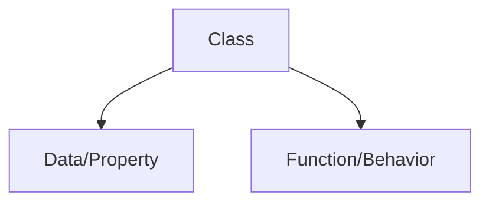

# OOP

*"Everything in Python is an object"*

 **OOP** allows user to create *new data types*

## Class



Class is a blueprint that dictates how an object/function will act.

```
list() -- This is  class

l = list([1,2,3]) -- This is an object of the class
```

Class is written using **PASCAL**

    - HelloWorld -- *This is pascal*

### Object

Object is an instance of a class

### Example of OOP

Lets create a small **ATM** using OOP.


```
class Atm:

    # constructor 
    '''
    - All variables are created inside constructor
    - Constructor is a special function
        - It has a superpower --> It will automatically-execute unlike other functions
    '''
    def __init__(self):
        self.pin = ''
        self.balance = 0
        # print('Auto execute')
        self.menu()

    def menu(self):
        user_input = input("""              
              How can I help you?
              1 : Press 1 to create PIN?
              2 : Press 2 to change PIN.
              3 : Press 3 to check balance
              4 : Press 4 to withdraw
              5 : Anything else to exit
              """)
        if user_input =='1':
            # Create PIN
        elif user_input = '2':  
            #change pin
        elif user_input = '3':
            #check balance
        elif user_input = '4':
        # withdraw
        else:
            exit()

    def create_pin(self):
        user_pin = input('Enter your PIN')
        self.pin = user_pin

        int(input('Enter balance'))
```

