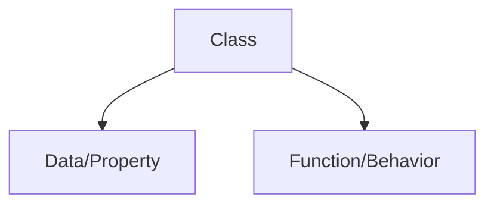
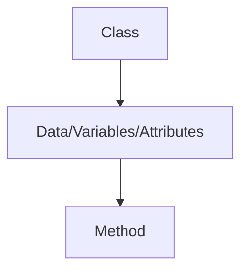

# OOP

*"Everything in Python is an object"*

 **OOP** allows user to create *new data types*

## Class



Class is a blueprint that dictates how an object/function will act.

```
list() -- This is  class

l = list([1,2,3]) -- This is an object of the class
```

Class is written using **PASCAL**

    - HelloWorld -- *This is pascal*

### Object

Object is an instance of a class

### Example of OOP

Lets create a small **ATM** using OOP.


```
class Atm:

    # constructor 
    '''
    - All variables are created inside constructor
    - Constructor is a special function
        - It has a superpower --> It will automatically-execute unlike other functions
    '''
    def __init__(self):
        self.pin = ''
        self.balance = 0
        self.amount = 0
        # print('Auto execute')
        self.menu()
        

    def menu(self):
        user_input = input("""              
              How can I help you?
              1 : Press 1 to create PIN?
              2 : Press 2 to change PIN.
              3 : Press 3 to check balance
              4 : Press 4 to withdraw
              5 : Anything else to exit
              """)
        if user_input =='1':
            self.create_pin()
            # Create PIN
        elif user_input == '2':  
            self.change_pin()
            #change pin
        elif user_input == '3':
            self.check_balance()
            #check balance
        elif user_input == '4':
            self.withdrawl()
        # withdraw
        else:
            exit()

    def create_pin(self):
        user_pin = input('Enter your PIN')
        self.pin = user_pin

        user_balance = int(input('Enter balance'))
        self.balance = user_balance

        print("Code created successfully!")
        self.menu()

    def change_pin(self):
        old_pin = input("Enter old PIN")
        if old_pin == self.pin:
            new_pin = input("Enter new PIN")
            self.pin = new_pin
            print("PIN changed successful")
            self.menu()
        else:
            print("Can't change pin")
            self.menu()

    def check_balance(self):
        user_pin = input("Please enter your PIN")
        if user_pin == self.pin:
            print(f'The balance is {self.balance}')
        else:
            print("Wrong PIN")
        self.menu()
        
    def withdrawl(self):
        user_pin = input("Enter your PIN")
        if user_pin == self.pin:
            with_drawl = int(input("How much money would like to withdrawl"))
            if with_drawl >0:
                # balance = input("Blance you would like to withdraw")
                new_balance = self.balance - with_drawl
                print(f"Total balance is {new_balance}")
                self.balance = new_balance
            else:
                print("Your balance is 0")
        else:
            print("Incorrect credentials")
        self.menu()
```

## Methods vs functions

**Method** are functions that are written with *OOP* whereas functions that are independed and outside of a class. 

## Class Diagram



- **+** - Public

- **-** Private

## Magic Method *aka Dunder **Method*

Magic &rarr; Special &rarr; Super Power

- `__name__` &rarr; This is a method method
  - e.g. `__init__` &rarr; Constructor

### What are some true benefits of a constructor?

- True benefits is used to write *configuration related code*. 

- God is programmer &rarr; Earth is class &rarr; Humans are objects.
    
- Contructor purpose in this example would be to prevent humans from have the power of death.

## Self 

- Self is a *default* parameter in all functions in class. 

- Self allows methods to communicate with each other in OOP

- self &harr; object

#### Golden Rule of OOP

- Attributes and method can only be accessed by it's *object*. 
- It cannot communicate with each other. 

### `__str__ `

- Returns code in a class
### `__add__`

- Allows us to add

### `__sub__, __Multi__, __Div__`

- They all do their respective operations.