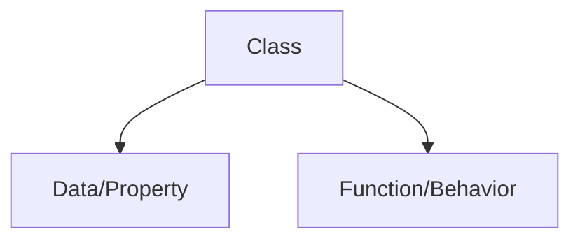
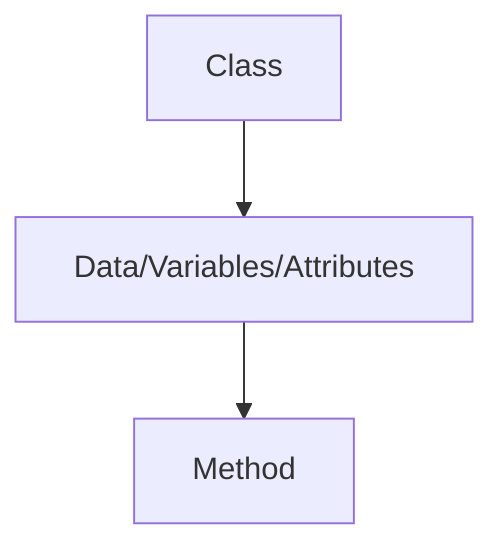
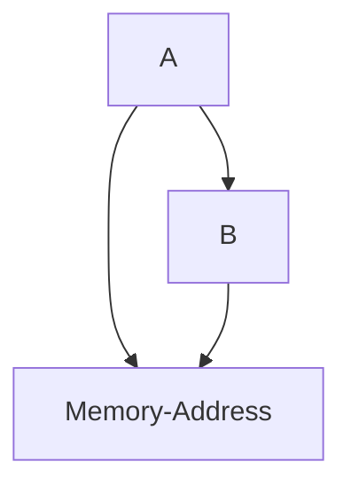
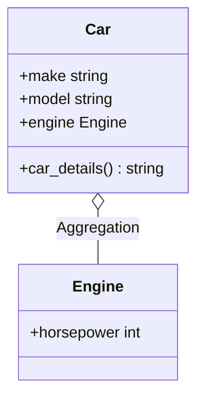
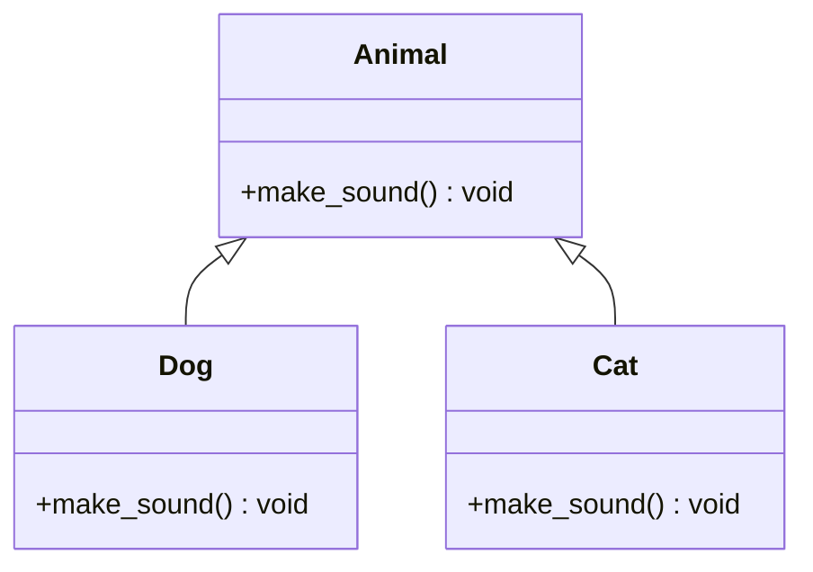

# OOP

*"Everything in Python is an object"*

 **OOP** allows user to create *new data types*

## Class



Class is a blueprint that dictates how an object/function will act.

```
list() -- This is  class

l = list([1,2,3]) -- This is an object of the class
```

Class is written using **PASCAL**

    - HelloWorld -- *This is pascal*

### Object

Object is an instance of a class

### Example of OOP

Lets create a small **ATM** using OOP.


```
class Atm:

    # constructor 
    '''
    - All variables are created inside constructor
    - Constructor is a special function
        - It has a superpower --> It will automatically-execute unlike other functions
    '''
    def __init__(self):
        self.pin = ''
        self.balance = 0
        self.amount = 0
        # print('Auto execute')
        self.menu()
        

    def menu(self):
        user_input = input("""              
              How can I help you?
              1 : Press 1 to create PIN?
              2 : Press 2 to change PIN.
              3 : Press 3 to check balance
              4 : Press 4 to withdraw
              5 : Anything else to exit
              """)
        if user_input =='1':
            self.create_pin()
            # Create PIN
        elif user_input == '2':  
            self.change_pin()
            #change pin
        elif user_input == '3':
            self.check_balance()
            #check balance
        elif user_input == '4':
            self.withdrawl()
        # withdraw
        else:
            exit()

    def create_pin(self):
        user_pin = input('Enter your PIN')
        self.pin = user_pin

        user_balance = int(input('Enter balance'))
        self.balance = user_balance

        print("Code created successfully!")
        self.menu()

    def change_pin(self):
        old_pin = input("Enter old PIN")
        if old_pin == self.pin:
            new_pin = input("Enter new PIN")
            self.pin = new_pin
            print("PIN changed successful")
            self.menu()
        else:
            print("Can't change pin")
            self.menu()

    def check_balance(self):
        user_pin = input("Please enter your PIN")
        if user_pin == self.pin:
            print(f'The balance is {self.balance}')
        else:
            print("Wrong PIN")
        self.menu()
        
    def withdrawl(self):
        user_pin = input("Enter your PIN")
        if user_pin == self.pin:
            with_drawl = int(input("How much money would like to withdrawl"))
            if with_drawl >0:
                # balance = input("Blance you would like to withdraw")
                new_balance = self.balance - with_drawl
                print(f"Total balance is {new_balance}")
                self.balance = new_balance
            else:
                print("Your balance is 0")
        else:
            print("Incorrect credentials")
        self.menu()
```

## Methods vs functions

**Method** are functions that are written with *OOP* whereas functions that are independed and outside of a class. 

## Class Diagram



- **+** - Public

- **-** Private

## Magic Method *aka Dunder **Method*

Magic &rarr; Special &rarr; Super Power

- `__name__` &rarr; This is a method method
  - e.g. `__init__` &rarr; Constructor

### What are some true benefits of a constructor?

- True benefits is used to write *configuration related code*. 

- God is programmer &rarr; Earth is class &rarr; Humans are objects.
    
- Constructor purpose in this example would be to prevent humans from have the power of death.

## Self 

- Self is a *default* parameter in all functions in class. 

- Self allows methods to communicate with each other in OOP

- self &harr; object

#### Golden Rule of OOP

- Attributes and method can only be accessed by it's *object*. 
- It cannot communicate with each other. 

### `__str__ `

- Returns code in a class
### `__add__`

- Allows us to add

### `__sub__, __Multi__, __Div__`

- They all do their respective operations.

# Encapsulation

### Write OOP classes to handle the following scenarios:;

- A user can create and view 2D coordinates
- A user can find out the distance between 2 coordinates
- A user can find the distance of a coordinate from origin 
- A user can check if a point lies on a given line 
- A user can find the distance between a given 2D point and a given line

```
class Point:
    def __init__(self,x_coordinate, y_coordinate):
        self.x_coordinate = x_coordinate
        self.y_coordinate = y_coordinate

    def __str__ (self):
        return '< {}, {} >'.format(self.x_coordinate, self.y_coordinate)
    
    def eucliden_distance(self, other):
        return ((self.x_coordinate - other.y_coordinate)**2 + (self.y_coordinate - other.y_coordinate)**2)**0.5
    
    def distance_from_origin(self):
        return self.eucliden_distance(Point(0,0))
    
class LineClass:
    def __init__(self, A,B,C):
        self.A = A
        self.B = B
        self.C = C
    
    def __str__(self):
        return '{}x + {}y + {} = 0'.format(self.A, self.B, self.C)
    
    def point_on_line(line, point):
        if line.A*point.x_coordinate + line.B*point.y_coordinate + line.C == 0:
            return 'Lies on the line'
        else:
            return 'Does not lie on the line'
        
    def shortest_distance(line, point):
        return abs(line.A*point.x_coordinate + line.B*point.y_coordinate + line.C)/(line.A**2 + line.B**2)
```
## Reference Variable

Variable used to create an object contains reference of the object

- Refrence variables hold the objects
- We can create objects without reference variable as well
- An object can have multiple reference variable
- Assigning a new reference variable to an existing object does not create a new object



## Pass by reference

UDF functions in python are *mutable*


```
class Person:
    def __init__(self, name, gender):
        self.name = name
        self.gender = gender

def greet(person):
    print('Hi, my name is', person.name, 'and I am a', person.gender)
    print(id(person))
    p1 = Person('Batman', 'Male')
    return p1

p = Person('Batman', 'Male')
x = greet(p)
print(id(p))
print(x.name)
print(x.gender)
```
##  Encapsulation

**Instance Variable** - Instance variables are type of variables that have different values for each object.

- `__ name` will make a private variable 

- `__name` create a new variable in the memory therefor it can not be accessed outside the class

- ***"Nothing truly is private in python"***

- Always use `__` infront of each variable

### Purpose 
- Make variable private 
- Getter and Setter 

## Static vs Instance 

Instance variable is different for *each object* whereas static variable is *same for all objects.*

- Instance is inside the constructor whereas static is inside each method

## Class Relationships

- Aggregation
- Inheritance

## Class Relationship: Aggregation



- Aggregation: This is a "has-a" relationship where one class contains a reference to another class. It represents a whole-part relationship, but both classes can exist independently.

- **Note**: Aggregation can’t be performed directly on private variables, as private members are meant to be accessed only within their own class.

```
class Engine:
    def __init__(self, horsepower):
        self.horsepower = horsepower

class Car:
    def __init__(self, make, model, engine):
        self.make = make
        self.model = model
        self.engine = engine  # Aggregation: Car "has-a" Engine

    def car_details(self):
        return f"{self.make} {self.model} with {self.engine.horsepower} HP engine"

engine = Engine(150)
car = Car("Toyota", "Corolla", engine)
print(car.car_details())  # Output: Toyota Corolla with 150 HP engine

```

## Inheritance and Polymophism


## Inheritance

Inheritance is a fundamental concept in OOP that allows one class (the child or derived class) to inherit attributes and methods from another class (the parent or base class).


### What gets inherited?



- Attributes and Methods: The child class inherits all the attributes and methods from the parent class. However, the child class can override these methods or extend them if needed.

- Constructor (__init__ method): The constructor of the parent class is not automatically called in the child class. You need to use super() to call it explicitly if required.

```
class Parent:
    def __init__(self):
        self.parent_attribute = "This is a parent attribute."

    def show_message(self):
        return "This is a message from the parent class."

class Child(Parent):
    def __init__(self):
        super().__init__()  # Calling the parent constructor
        self.child_attribute = "This is a child attribute."

child_instance = Child()
print(child_instance.parent_attribute)  # Output: This is a parent attribute.
print(child_instance.show_message())    # Output: This is a message from the parent class.

```
- Public and Protected Members: The child class inherits all public and protected members of the parent class. Private members are not directly inherited but can be accessed using getter and setter methods if needed.


