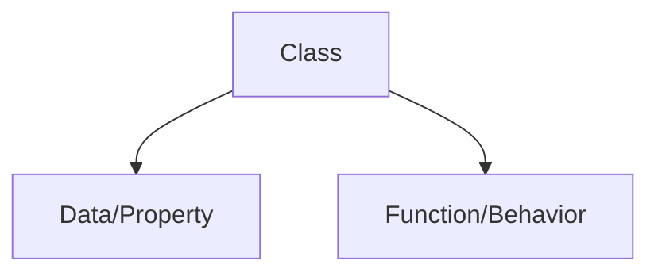

# OOP

*"Everything in Python is an object"*

 **OOP** allows user to create *new data types*

## Class



Class is a blueprint that dictates how an object/function will act.

```
list() -- This is  class

l = list([1,2,3]) -- This is an object of the class
```

Class is written using **PASCAL**

    - HelloWorld -- *This is pascal*

### Object

Object is an instance of a class

### Example of OOP

Lets create a small **ATM** using OOP.


