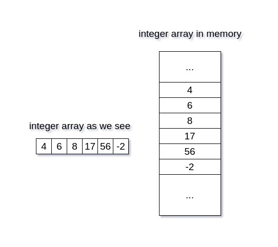

## Python list

### What are Lists?

List is a datat type where you can store multiple items under 1 name. More technically, lists act like **dynamic arrays** which means you can add more items on the fly. 

> L = [20, 'jessa', 35.75, [30,60,90]]
---
### Array vs Lists

- Fixed vs Dynamic size
-  Convenience -> ***Hetroogenous***
-  Arrays are ***homogenous*** (only store same data type)
-  Speed of execution (***Array runs faster than list***)
-  Memory (***Array take less memory compared to list***)

> Array->  array[Fixed size]

#### How are arrays stored in memory?

Arrays are stored in memory using their memory address. For example, instead of memory storing 4 from an array below, it will store it's binary address instead. 

> arrays --> int arr(50)




--- 

#### How are lists stored?

> List = [1,2,3,4,5]

Let's say the number 1 is stored at memory address 500, the number 2 at address 1000, and so on. Instead of storing the actual numbers, a memory block will store these addresses. This memory block also has its own address, like 5000 for example, where the reference to 1 is stored. This is known as a **referential array**.

#### Referential Array

A referential array is an array that stores memory addresses (references or pointers) of its elements, rather than the actual data values themselves.


```
L = [1,2,3,4,5]

print(id(L[1]))
print(id(L[2]))
print(id(L[3]))
print(id(L[4]))
print(id(L[0]))

Ouput
140720090986968
140720090987000
140720090987032
140720090987064
140720090986936
```

---

#### Key differences between Arrays and Lists

- **Memory Layout**: Arrays store elements in contiguous memory blocks, allowing faster access, while lists store references to objects that may be scattered in memory.

- **Memory Overhead**: Lists require extra memory for storing references and managing dynamic resizing, leading to higher memory usage compared to arrays.

- **Cache Performance**: Arrays benefit from better cache locality, while lists may experience cache misses due to non-contiguous memory allocation.

- **Type Consistency**: Arrays store elements of a single type, which is more memory-efficient, while lists can store multiple types, requiring additional type checking and conversion.

- **Dynamic Resizing**: Lists support dynamic resizing, which involves memory reallocation and copying elements, adding overhead and slowing down operations.

