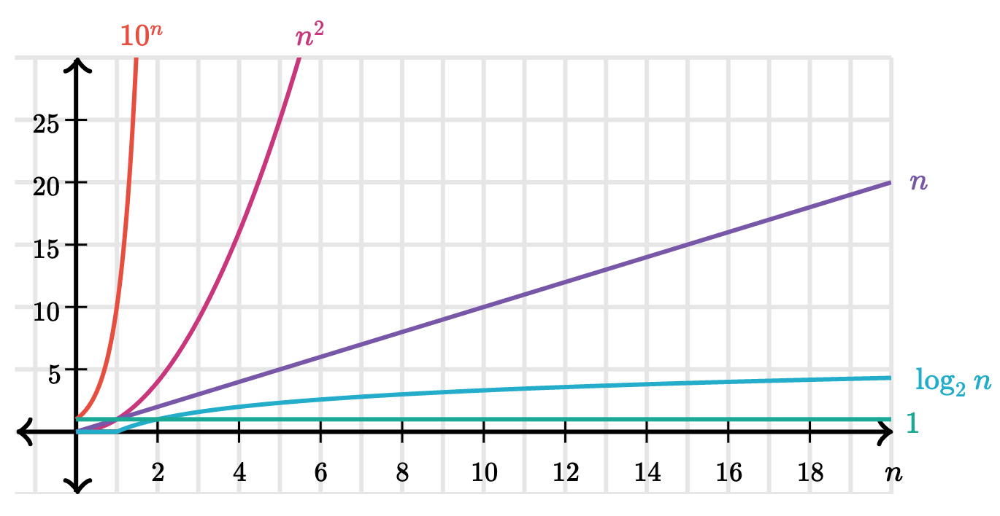
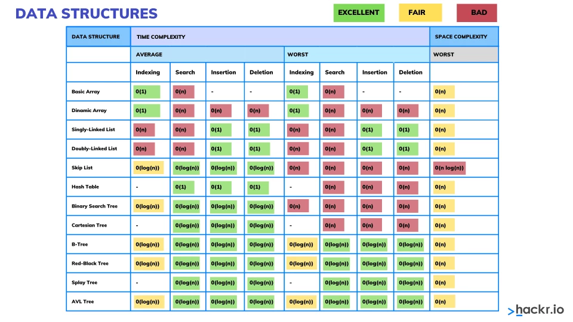

# Time Complexity
Time Complexity is a way to describe how the runtime of an algorithm changes as the size of the input grows.

#### Order of Growth
- want to evaluate program's efficiency when **input is very big**
- Want to express the **growth of program's run time** as input size grows.
- Want to put an **upper bound** on growth-as tight as possible.
- do not need to be precise: **"order of"** not **exact** growth.
- we will look at the **largest factors** in runtime (which section of the program will take the longest to run).

```
def fact_iter(n):
    answer = 1 # 1 operation
    while n>1: # 1 operation
        answer *=n # 2 operation
        n-=1 # 2 operation
    return answer # 1 operation

```

***1 + 5n + 1*** is the equation of above code

#### Big 0 N steps


- ignore additive constants
- ignore multiplications constants

## Types of orders of growth
1. Constant 
2. Linear
3. Quadratic
4. Logarithmic : *Binary Search* is an example of this
5. nlogn : Mainly used in *sorting algorithim*
6. Exponential 




#### Law of Addition
- used with **sequential** statments

- ``` O(f(n) + O(g(n)) is O(f(n)) + g(n))```

for example:

```
for i in range(n):
  print('a')
  for j in range(n*n):
    print('b')

```
is ``` O(n) + O(n*n) = O(n+n^2) ``` because of domainant term

#### Law of multiplication
- used with nested loops
- ```O(f(n)) * O(g(n)) is O(f(n) * g(n))```
for example

```
for i in range(n):
    for j in range(n):
        print('a')
```

if `O(n)*O(n) = O(n*n) = O(n^2)` because the outer loops goes n times and the inner liip goes n times for every outer loop iter. 



```
number = int(input('Enter the number'))

digits = '0123456789'
result = ''

while number !=0:
    result = digits[number % 10] + result
    number = number//10

print(result)

```

***Big O of this would be log(n)***


